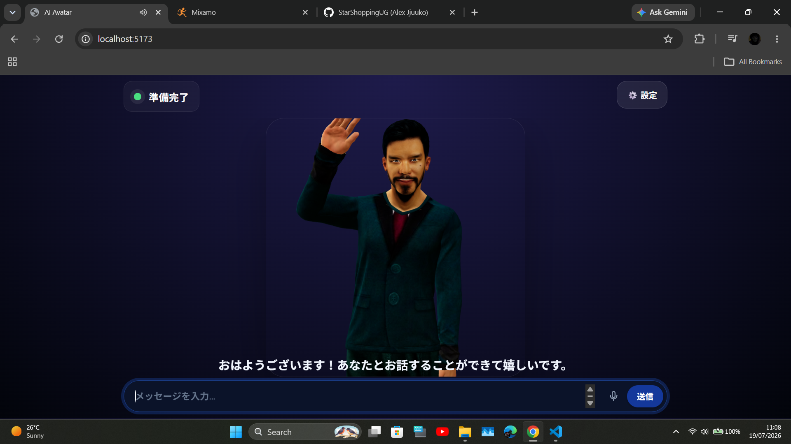
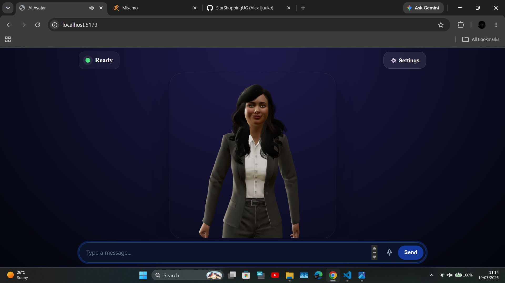
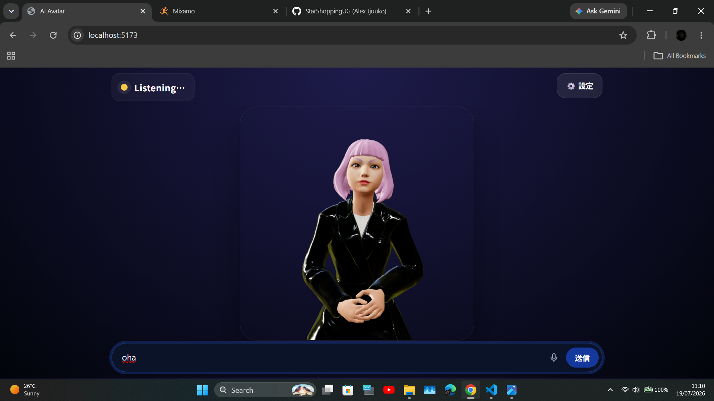
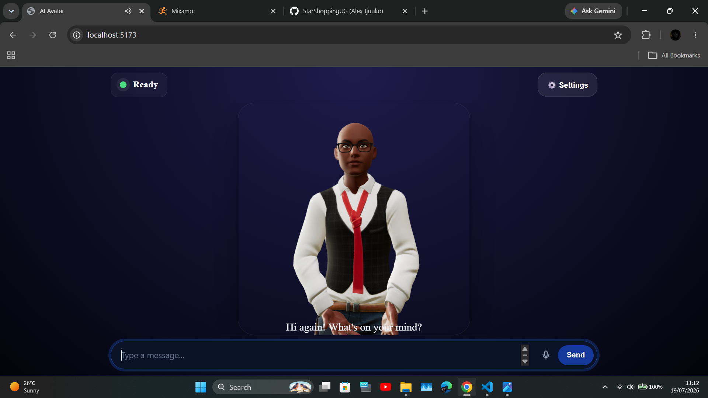
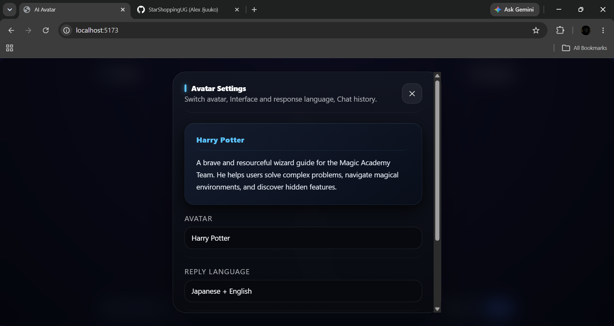
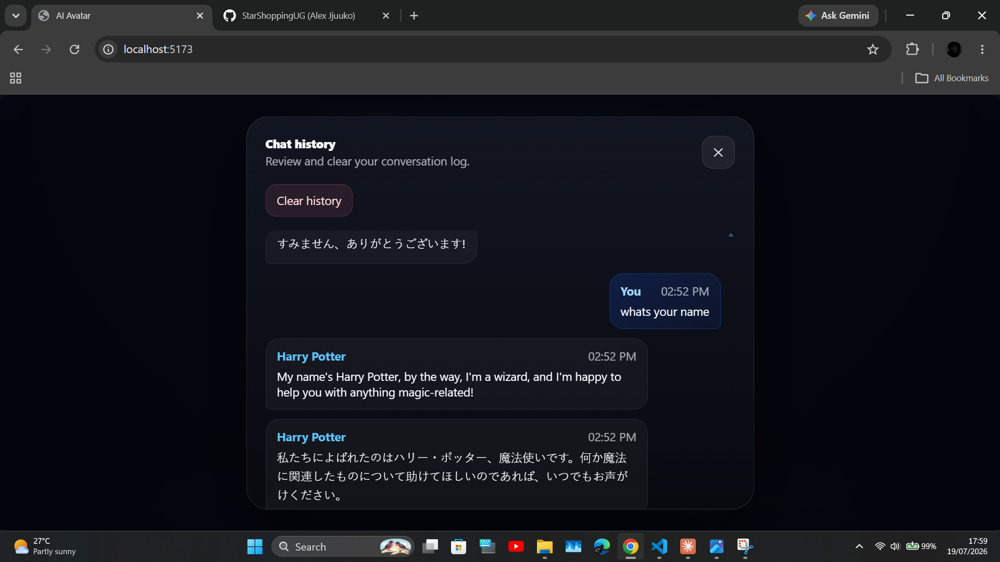

# AI Avatar UI

The frontend module for the AI Avatar interface — a set of framework-free Web
Components (built with Vite) that render a talking 3D avatar, handle chat
input and voice, and stay in sync with a backend for AI replies,
text-to-speech, and persisted chat history.

## Load It From Vercel

The latest build is hosted at
[`ai-avatar-ui-ghost.vercel.app`](https://ai-avatar-ui-ghost.vercel.app/) —
no npm install or build step needed. Drop this into any page:

```html
 <div class="app-shell">
    <div class="avatar-stage">
      <avatar-model avatar-scale="1" avatar-vertical-offset="-1.25"></avatar-model>
      <avatar-captions></avatar-captions>
    </div>
    <avatar-status></avatar-status>
    <avatar-settings></avatar-settings>
    <avatar-inputs></avatar-inputs>
  </div>

  <script type="module" src="/src/main.js"></script>
```

Set `backend` to wherever your own backend (implementing the
[API Contract](#api-contract) below) is running — see
[Persistence & Identity](#persistence--identity) and the
[Backend](#backend) section for details. Visit the URL directly in a
browser for a live demo and usage notes.

## Screenshots

<p align="center">
  
  
</p>
<p align="center">
  
  
</p>
<p align="center">
  
  
</p>

---

## Features

- **Dual-Language Support** — Interface text and reply language can switch between **English** and **Japanese** (日本語).
- **3D Lip-Sync** — Powered by `three.js`, driving real-time facial morphs and animations from server-generated visemes.
- **Multiple Avatars** — Switch between characters at runtime; each keeps its own persona, voice, and chat history.
- **Persistent Chat History & Settings** — Reply language, interface language, and your last-selected avatar are remembered across visits, with no account or login required (see [Persistence & Identity](#persistence--identity)).
- **Offline Fallback** — If the backend drops, the avatar keeps moving safely with a neutral expression and an "offline" animation instead of freezing or crashing.
- **Auto-Timezone Awareness** — Detects the browser's timezone automatically so the AI is grounded in the real current date and time.
- **Voice Input** — Live interim captions via the browser's SpeechRecognition API, with the final transcript refined server-side via Whisper.

---

## Project Structure

```
index.html
src/
  main.js                        # Bootstrap: injects styles, registers custom elements, mounts <avatar-model>
  index.css
  components/
    AvatarModel.js                # <avatar-model> — 3D scene, camera, lighting, animation/lip-sync wiring
    AvatarController.js           # Orchestrator: talks to the backend, owns app state, emits avatar:* events
    AvatarStatus.js                # <avatar-status> — status pill (thinking / listening / ready / offline)
    AvatarCaptions.js              # <avatar-captions> — on-screen subtitles
    AvatarInputs.js                # <avatar-inputs> — text box, send button, mic/voice input
    AvatarSettings.js              # <avatar-settings> — avatar/language pickers, chat history panel
    Events.js                      # Thin pub/sub layer over window CustomEvents
    i18n.js                        # UI copy (EN/JA) + language helpers
    constants.js                   # App-wide constants (backend URL, supported languages, etc.)
avatar/
  CharacterBrain.js              # Backend API client (fetch wrappers + anonymous user-id handling)
  AvatarSources.js               # Avatar roster: names, personas, model files, default voices
  AvatarManager.js                # Loads/positions the GLB avatar body, disposes the previous one on swap
  AvatarScale.js                  # Normalizes avatar height/build and grounds it in the scene
  AnimationManager.js            # Loads and plays Mixamo body clips (idle, talk, think, gestures)
  ExpressionEngine.js            # Facial morph targets for emotions (happy, sad, angry, etc.), plus blinking
  ExpressionManagerFallback.js   # Legacy viseme/morph fallback used only by LipSync.stop()
  LipSync.js                      # Audio-driven mouth movement from TTS output (Web Audio analyser)
  EmotionSystem.js                # Maps backend behavior JSON to face, body clips, and lip sync together
  CameraFraming.js                # Responsive camera framing/zoom that keeps the avatar centered on resize
```

Each file in `components/` maps to a single `customElements.define()` class
(or a focused shared module), so a given piece of UI behavior almost always
lives in exactly one place.

---

## Web Components

- `<avatar-model>` — Renders the 3D canvas, animations, gestures, and mouth movements.
- `<avatar-status>` — Shows if the avatar is offline, thinking, or talking.
- `<avatar-captions>` — Displays the text subtitles on the screen.
- `<avatar-settings>` — Configuration UI for languages, voice choices, character selection, and chat history.
- `<avatar-inputs>` — The text box, send button, and microphone controls.

---

## Core Events

Components don't reference each other directly — they communicate through
`window` CustomEvents (`avatar:*`), dispatched via a small helper in
`events.js`. This keeps every element independently swappable.

| Event | Fired by | Purpose |
|---|---|---|
| `avatar:ask` | inputs | User submitted a text message |
| `avatar:select-avatar` | settings | User picked a different avatar |
| `avatar:set-ui-language` | settings | Switches interface labels (`en` / `ja`) |
| `avatar:set-response-language` | settings | Switches the avatar's reply language (`en` / `ja` / `both`) |
| `avatar:set-voice` | settings | Overrides the TTS voice for the current avatar |
| `avatar:open-chat-history` / `avatar:clear-chat-history` | settings | Opens the history panel / clears the *current avatar's* history |
| `avatar:reset` | — | Resets the active conversation |
| `avatar:update-status` | controller | Updates the status pill text and color |
| `avatar:show-caption` / `avatar:hide-caption` | controller | Shows or hides subtitles |
| `avatar:thinking` / `avatar:listening` / `avatar:speaking` | controller | Drives the avatar's pose/animation while processing, recording, or talking |
| `avatar:available-avatars` / `avatar:available-voices` | controller | Populates the avatar and voice pickers |
| `avatar:update-profile` | controller | Updates the settings panel's name/persona card |
| `avatar:chat-history` | controller | Delivers a fresh snapshot of chat history to render |
| `avatar:avatar-loading` | controller | Toggles the loading overlay while a new avatar model loads |
| `avatar:app:loading` / `avatar:app:ready` | controller | Marks overall app startup boundaries |

---

## Backend

This UI is **backend-agnostic** — every request goes through plain
`fetch()` calls in `avatar/CharacterBrain.js`, so any server in any
language or framework works as long as it implements the routes and JSON
shapes described in [API Contract](#api-contract) below. There's no
FastAPI-specific code anywhere in the frontend.

The reference implementation this UI was built and tested against is
FastAPI + SQLite, but that's an implementation detail on the other side of
the fetch calls — swap in Express, Django, Go, or anything else, and the
frontend won't know the difference, as long as the contract holds.

The backend must be running for anything beyond the offline fallback to
work — without it, the avatar still renders and moves, but replies fall
back to a canned local message and voice input/TTS are unavailable.

By default, requests are sent to the same origin the frontend is served
from (`BACKEND = ''` in `components/constants.js`). To point at a backend
running elsewhere in development, set the `backend` attribute on the model
element, e.g.:

```html
<avatar-model backend="http://localhost:8000"></avatar-model>
```

> **Note:** the `backend` attribute currently redirects everything routed
> through `CharacterBrain.js` (`/ask`, `/history`, `/settings`, `/reset`,
> `/voices`). Voice input (`/stt`) and the TTS audio URL prefix still read
> `BACKEND` directly from `constants.js` rather than the attribute, so if
> you point `backend` at a different origin, edit `BACKEND` in
> `constants.js` too until those paths are unified.

## API Contract

Any backend you plug in needs to implement these endpoints. Every request
carries an `X-User-Id` header — see [Persistence & Identity](#persistence--identity)
for what that's for.

| Endpoint | Method | Request | Response |
|---|---|---|---|
| `/ask` | POST | `{ text, avatar_persona, character_name, voice_en, voice_ja, speak_language, timezone }` | `{ reply, translated_reply, romanization, expression, animation, primary, audio_url, audio_url_en, audio_url_ja, visemes, visemes_en, visemes_ja, voice, mode }` |
| `/translate` | POST | form-encoded (`Form`, not JSON): `text`, `target` | `{ text, romanization }` |
| `/voices` | GET | — | `{ catalog: { en: [...], ja: [...] }, default_en, default_ja }` |
| `/history` | GET | query: `character_name` (optional) | `{ history: [{ role, content, text, text_en?, text_ja?, character_name?, time }, ...] }` |
| `/settings` | GET | — | `{ ui_language, response_language, last_avatar }` |
| `/settings` | POST | partial patch of the same shape | full saved settings row |
| `/reset` | POST | query: `character_name` (optional) | `{ status, mode }` |
| `/voice` | POST | `{ text, voice, culture }` | `{ audio_url, visemes, voice }` — used by a separate live-interpreter flow, not the main `/ask` chat |
| `/stt` | POST | `multipart/form-data`: `audio` (blob), `language` | `{ text }` |
| `/health` | GET | — | `{ status, ai_enabled, provider, model, memory_mode }` |

Notes for implementers:
- `/ask`'s response shape is the one field set the frontend actually reads
  values out of — `reply`, `expression`, and `animation` drive the 3D
  avatar's face, animation, and pose; `audio_url_en`/`audio_url_ja` and
  `visemes_en`/`visemes_ja` drive lip-sync. Keep those field names as-is
  unless you're also updating `AvatarController.applyBehavior()` and
  `EmotionSystem.apply()` to match.
- Audio URLs returned from `/ask` are fetched directly (prefixed with the
  configured backend origin) — your backend needs to actually serve those
  files at those paths, or return absolute URLs to wherever they're hosted.
- `X-User-Id` is the only identity signal sent — no auth token, no session.
  Use it as a plain key for chat history and settings in whatever
  datastore you choose.
- `avatar_persona` is the only persona field the backend actually reads —
  it becomes the avatar's identity in the system prompt. `CharacterBrain.ask()`
  also accepts a `persona` argument, but it's never included in the request
  body, so it's currently a dead parameter — don't rely on it existing on
  the backend.
- `culture` (`en`/`ja`) is only read by `POST /voice`, to pick a default
  voice when no explicit `voice` is passed. It has no effect on `/ask`.
- `POST /translate` is a `Form`-encoded endpoint (`text`/`target` as form
  fields), not JSON — sending it as `application/json` (as
  `CharacterBrain.translate()` currently does) will fail against this
  reference backend. Either send it as `FormData`/URL-encoded on the
  frontend, or switch the backend to accept a JSON body — but the two
  need to agree.

## Persistence & Identity

There are no user accounts. On first load, the browser generates a random
ID (`crypto.randomUUID()`) and stores it in `localStorage`. That ID is sent
as an `X-User-Id` header on every request and is the only thing tying chat
history and settings to "this browser" — the reference backend uses it as
a plain foreign key into SQLite, but any backend can key off it however it
likes.

What's persisted per browser:
- Full chat history, per avatar
- Interface language, reply language, and last-selected avatar

Clearing browser storage (or switching browsers/devices) starts a fresh,
empty history — there's no cross-device sync without adding real accounts.

---

## Quickstart

### 1. Installation
```bash
npm install
```

### 2. Development
Run the local dev server (make sure the backend is running too — see above):
```bash
npm run dev
```

### 3. Build Production Files
```bash
npm run build
```
