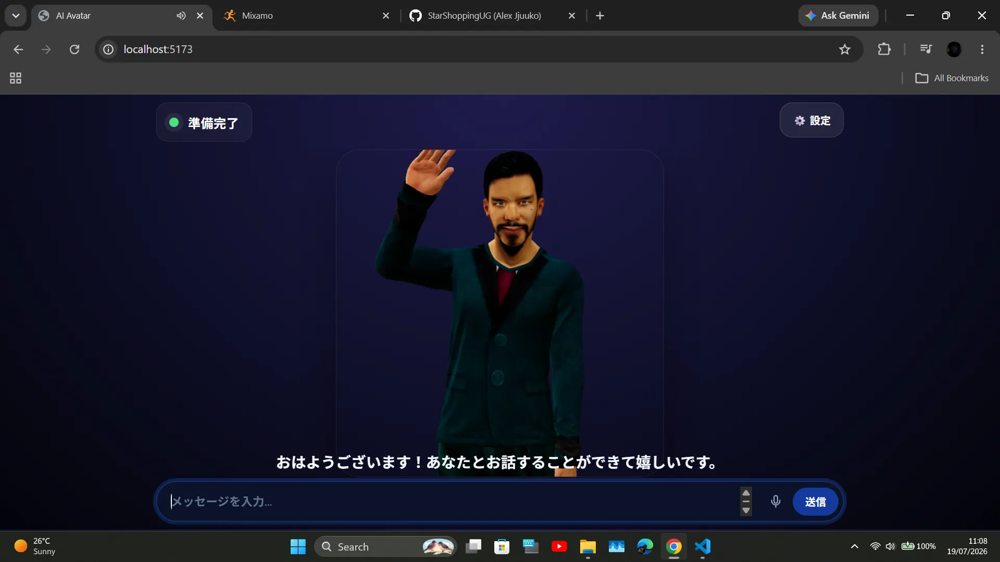
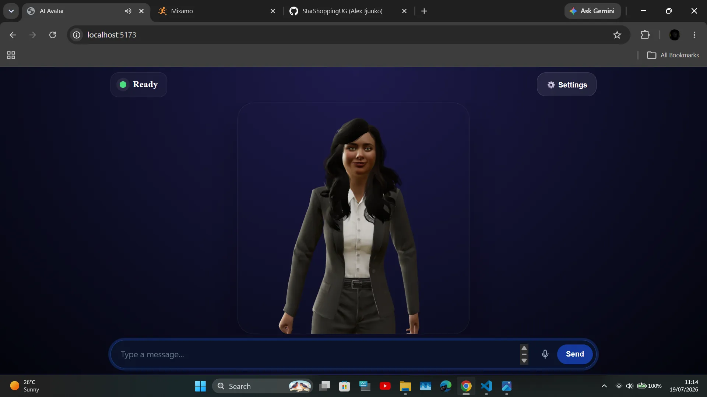
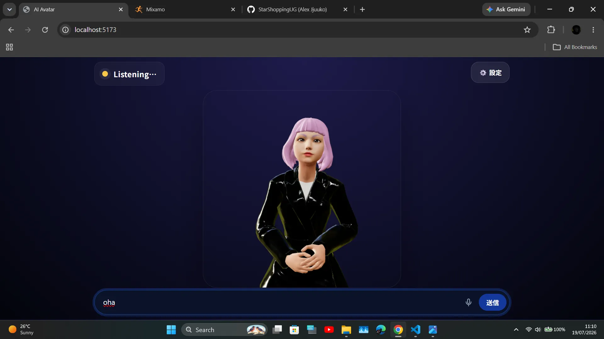
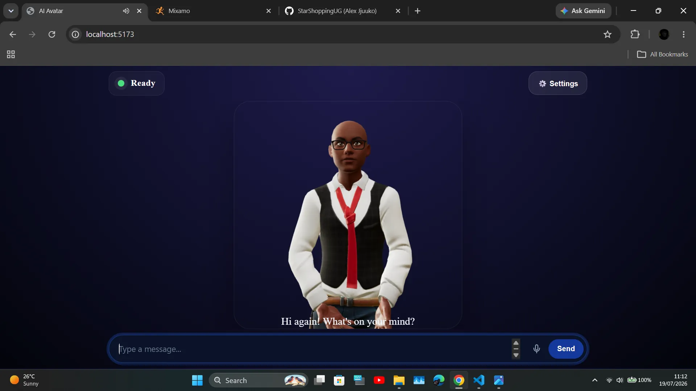
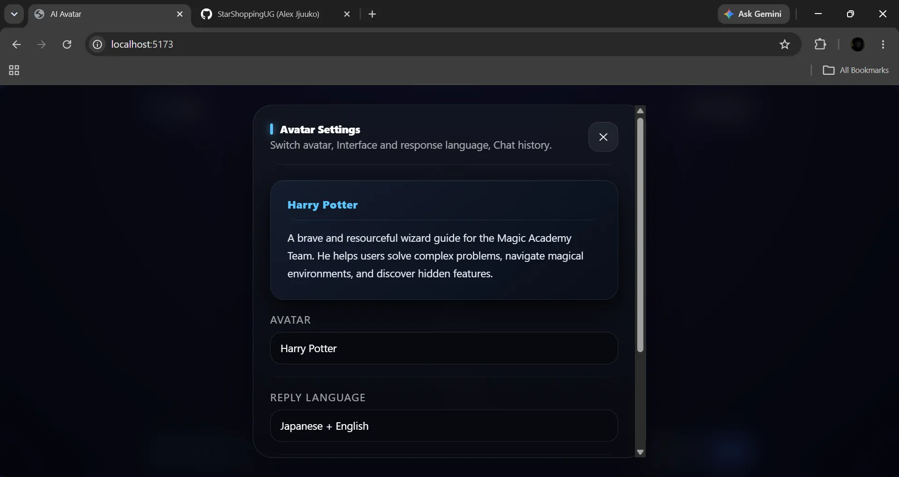
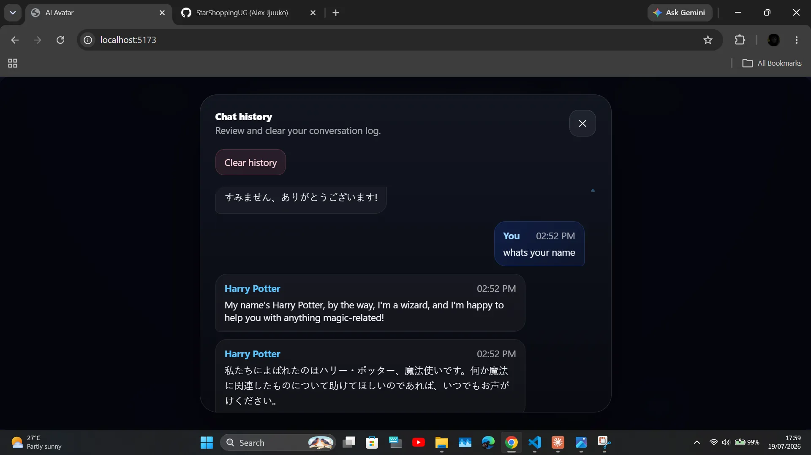

# AI Avatar UI

The frontend module for the AI Avatar interface — a set of framework-free Web
Components (built with Vite) that render a talking 3D avatar, handle chat
input and voice, and stay in sync with a backend for AI replies,
text-to-speech, and persisted chat history.

## 🚀 Live Demo

**[Check out the live demo →](https://ai-avatar-ui-ghost.vercel.app/)**

## Screenshots

<p align="center">
  
  
</p>
<p align="center">
  
  
</p>
<p align="center">
  
  
</p>

---

## Load It From Vercel

The latest build is hosted at
[`ai-avatar-ui-ghost.vercel.app`](https://ai-avatar-ui-ghost.vercel.app/) —
no npm install or build step needed. Drop this into any page:

Html
```html
 <div class="ai-avatar-shell">
    <div class="avatar-stage">
      <avatar-model
        backend="backend-url"
        app-id="your-app-id"
        avatar-scale="1"
        avatar-vertical-offset="-1.25"
        avatar-scale-mobile="0.75"
        avatar-vertical-offset-mobile="-0.6"
      ></avatar-model>
      <avatar-captions></avatar-captions>
    </div>
    <avatar-status></avatar-status>
    <avatar-settings></avatar-settings>
    <avatar-inputs backend="backend-url"></avatar-inputs>
  </div>

  <script type="module" src="https://ai-avatar-ui-ghost.vercel.app/ai-avatar-ui.js"></script>
```

> To point `<avatar-inputs>` at your own existing chat UI instead of its
> built-in textarea/buttons, see [Custom Input Elements](#custom-input-elements).

React/Next.js
```jsx
'use client'
import { useEffect } from 'react';

export default function AvatarWidget() {
  useEffect(() => {
    const script = document.createElement('script');
    script.type = 'module';
    script.src = 'https://ai-avatar-ui-ghost.vercel.app/ai-avatar-ui.js';
    script.async = true;
    document.body.appendChild(script);

    return () => {
      document.body.removeChild(script);
    };
  }, []);

  return (
    <div className="ai-avatar-shell">
      
      <div className="avatar-stage" style={{ position: 'relative', width: '100%', height: '400px' }}>
        <avatar-model
          backend="backend-url"
          app-id="your-app-id"
          avatar-scale="1"
          avatar-vertical-offset="-1.25"
          avatar-scale-mobile="0.75"
          avatar-vertical-offset-mobile="-0.6"
          style={{ position: 'absolute', top: 0, left: 0, width: '100%', height: '100%' }}
        ></avatar-model>
        <avatar-captions></avatar-captions>
      </div>

      <avatar-status></avatar-status>
      <avatar-settings></avatar-settings>
      <avatar-inputs backend="backend-url"></avatar-inputs>
      
    </div>
  );
}
```

Set `backend` to wherever your own backend (implementing the
[API Contract](#api-contract) below) is running — see
[Persistence & Identity](#persistence--identity) and the
[Backend](#backend) section for details. `app-id` is optional but
recommended for any third-party integration — see
[Persistence & Identity](#persistence--identity). Visit the URL directly
in a browser for a live demo and usage notes.


## Features

- **Dual-Language Support** — Interface text and reply language can switch between **English** and **Japanese** (日本語).
- **3D Lip-Sync** — Powered by `three.js`, driving real-time facial morphs and animations from server-generated visemes.
- **Multiple Avatars** — Switch between characters at runtime; each keeps its own persona, voice, and chat history.
- **Persistent Chat History & Settings** — Reply language, interface language, and your last-selected avatar are remembered across visits, with no account or login required (see [Persistence & Identity](#persistence--identity)).
- **Multi-Tenant Ready** — Third-party apps embedding this widget can pass their own `app-id` (and optionally `user-id`) so each integrator's users stay fully isolated from every other integrator's. Settings can additionally be scoped per-app via `settings-scope="app"` (see [Persistence & Identity](#persistence--identity)).
- **Offline Fallback** — If the backend drops, the avatar keeps moving safely with a neutral expression and an "offline" animation instead of freezing or crashing.
- **Load-Failure Recovery** — see [Load Error Handling](#load-error-handling).
- **Auto-Timezone Awareness** — Detects the browser's timezone automatically so the AI is grounded in the real current date and time.
- **Voice Input** — Live interim captions via the browser's SpeechRecognition API, with the final transcript refined server-side via Whisper.
- **Editable Personas** — persisted to the backend (not `localStorage`), per avatar and per instance — see [Settings-Only Pages](#settings-only-pages--cross-page-configuration).
- **Bring-Your-Own Input UI** — see [Custom Input Elements](#custom-input-elements).
- **Multiple Avatars Per Page** — see [Multiple Avatar Instances](#multiple-avatar-instances).
- **Language-Tutor Avatars** — avatars flagged `teachingMode: true` in `AvatarSources.js` speak in a natural mix of the language they teach and the student's native language (words being taught are inline-annotated with their reading), instead of a plain single-language reply — see the reference backend's `teaching_mode` handling in [API Contract](#api-contract).

---
## Project Structure

```text
index.html
src/
  main.js                        # Bootstrap: injects styles, registers custom elements, mounts <avatar-model>
  index.css
  components/
    AvatarModel.js                # <avatar-model> — 3D scene, camera, lighting, animation/lip-sync wiring, load-error/retry UI
    AvatarController.js           # Orchestrator: talks to the backend, owns app state, emits avatar:* events
    AvatarStatus.js                # <avatar-status> — status pill (thinking / listening / ready / offline)
    AvatarCaptions.js              # <avatar-captions> — on-screen subtitles
    AvatarInputs.js                # <avatar-inputs> — text box, send button, mic/voice input
    AvatarSettings.js              # <avatar-settings> — avatar/language pickers, chat history panel
    AvatarPickerCore.js            # Shared avatar-grid/persona-edit logic used by AvatarSettings
    events.js                      # Thin pub/sub layer over window CustomEvents
    i18n.js                        # UI copy (EN/JA) + language helpers
    constants.js                   # App-wide constants (backend URL, supported languages, etc.)
avatar/
  CharacterBrain.js              # Backend API client (fetch wrappers + app-id/user-id identity handling)
  AvatarSources.js               # Avatar roster: names, personas, model files, default voices, per-avatar teachingMode flag
  AvatarManager.js                # Loads/positions the GLB avatar body, disposes the previous one on swap, times out stalled loads
  AvatarScale.js                  # Normalizes avatar height/build and grounds it in the scene
  AnimationManager.js            # Loads and plays Mixamo body clips (idle, talk, think, gestures)
  ExpressionEngine.js            # Facial morph targets for emotions (happy, sad, angry, etc.), plus blinking
  ExpressionManagerFallback.js   # Legacy viseme/morph fallback used only by LipSync.stop()
  LipSync.js                      # Audio-driven mouth movement from TTS output (Web Audio analyser)
  EmotionSystem.js                # Maps backend behavior JSON to face, body clips, and lip sync together
  CameraFraming.js                # Responsive camera framing/zoom that keeps the avatar centered on resize

```
---

## Web Components

- `<avatar-model>` — Renders the 3D canvas, animations, gestures, and mouth movements. Shows a retry prompt if loading fails — see [Load Error Handling](#load-error-handling).
- `<avatar-status>` — Shows if the avatar is offline, thinking, or talking.
- `<avatar-captions>` — Displays the text subtitles on the screen.
- `<avatar-settings>` — Configuration UI for languages, voice choices, character selection, and chat history. Can run standalone, with no `<avatar-model>` on the page — see [Settings-Only Pages](#settings-only-pages--cross-page-configuration).
- `<avatar-inputs>` — The text box, send button, and microphone controls. Accepts its own `backend` attribute for the `/stt` endpoint — see [Backend](#backend). Optionally binds to your own existing elements instead of its own defaults — see [Custom Input Elements](#custom-input-elements) below.


---

## Core Events

Components don't reference each other directly — they communicate through
`window` CustomEvents (`avatar:*`), dispatched via a small helper in
`events.js`. This keeps every element independently swappable.

| Event | Fired by | Purpose |
|---|---|---|
| `avatar:ask` | inputs | User submitted a text message |
| `avatar:select-avatar` | settings, setup | User picked a different avatar |
| `avatar:set-ui-language` | settings, setup | Switches interface labels (`en` / `ja`) |
| `avatar:set-response-language` | settings, setup | Switches the avatar's reply language (`en` / `ja` / `both`) |
| `avatar:set-scale` | host page | Adjusts the loaded avatar's scale/vertical offset at runtime |
| `avatar:set-voice`¹ | settings | Overrides the TTS voice for the current avatar |
| `avatar:edit-persona` | settings | Saves an edited name/persona for an avatar |
| `avatar:reset-persona` | settings | Reverts an avatar's persona back to its built-in default |
| `avatar:open-chat-history` / `avatar:clear-chat-history` | settings | Opens the history panel / clears the *current avatar's* history |
| `avatar:reset` | — | Resets the active conversation |
| `avatar:request-current-profile` | any consumer | Read-only nudge asking the controller to (re)broadcast its current profile |
| `avatar:update-status` | controller | Updates the status pill text and color |
| `avatar:show-caption` / `avatar:hide-caption` | controller | Shows or hides subtitles |
| `avatar:thinking` / `avatar:listening` / `avatar:speaking` | controller | Drives the avatar's pose/animation while processing, recording, or talking |
| `avatar:available-avatars` | controller | Populates the avatar picker and settings panel |
| `avatar:available-voices`¹ | controller | Populates the voice picker |
| `avatar:update-profile` | controller | Updates the settings panel's/card's name/persona data |
| `avatar:chat-history` | controller | Delivers a fresh snapshot of chat history to render |
| `avatar:avatar-loading` | controller | Toggles while a specific avatar model is (re)loading, e.g. on selection |
| `avatar:load-error` | controller | Fires `{ active: true }` when an avatar fails to load (disables chat input until resolved) and `{ active: false }` on a successful (re)load |
| `avatar:app:loading` / `avatar:app:ready` | controller | Marks overall widget startup boundaries |
| `avatar:app:load-error` | controller | Signals the *initial* avatar load at startup failed — distinct from `avatar:load-error`, which covers a later avatar swap |

¹ Not confirmed against the shared picker (`AvatarPickerCore.js`), which has
no voice-select UI node wired up today — this may live elsewhere in
`AvatarSettings.js`, or be stale. Worth double-checking against source if
you're relying on voice switching.

---


## Load Error Handling

Avatar GLB files can be large, and on an unstable connection the load can
either fail outright or hang indefinitely. `<avatar-model>` handles both:

- **Stalled loads time out** after 20 seconds (see `AvatarManager.loadAvatar()`) instead of leaving the UI stuck on a spinner forever.
- **A failed load** shows a small retry prompt centered over the (blank) 3D area, explaining that this is most likely due to an unstable connection, with a **Retry** button that re-attempts the same avatar.
- **Chat input, mic, and send are disabled** for the duration of a load error (`avatar:load-error` event), and automatically re-enabled the moment a retry succeeds.
- Retrying goes through the exact same code path as a normal avatar selection — no separate/divergent retry logic to keep in sync.

---

## Responsive Scale (Mobile vs Desktop)

`<avatar-model>` supports separate scale/offset values for narrow viewports,
so the avatar doesn't render too zoomed-in on phones:

```html
<avatar-model
  avatar-scale="1"
  avatar-vertical-offset="-1.25"
  avatar-scale-mobile="0.75"
  avatar-vertical-offset-mobile="-0.6"
></avatar-model>
```

- `avatar-scale-mobile` / `avatar-vertical-offset-mobile` — optional. Applied
  instead of `avatar-scale`/`avatar-vertical-offset` whenever the viewport
  matches the mobile breakpoint. Each falls back to its non-mobile
  counterpart if left unset.
- `avatar-mobile-breakpoint` — optional, defaults to `640` (pixels). Sets the
  `max-width` cutoff used to decide "mobile."
- Reacts live to resize/rotation — no reload needed, same as the base
  `avatar-scale`/`avatar-vertical-offset` attributes.

## Custom Input Elements

By default `<avatar-inputs>` renders its own textarea, send button, and mic
button. If your page already has its own chat input UI, you can point
`<avatar-inputs>` at those elements instead via three optional attributes —
supply any combination of the three; whichever you omit still falls back to
the built-in default for that piece:

```html
<textarea id="my-chat-input"></textarea>
<button id="my-send-btn">Send</button>
<button id="my-mic-btn">🎤</button>

<avatar-inputs
  text-input="#my-chat-input"
  send-button="#my-send-btn"
  mic-button="#my-mic-btn"
></avatar-inputs>
```

Each attribute is a CSS selector, resolved once when `<avatar-inputs>`
connects. All existing behavior — sending on Enter, mic recording, Whisper
transcription via `/stt`, and disabling itself while the avatar is
thinking/speaking/loading/erroring — is wired onto whichever elements are
in use, built-in or your own. If a selector doesn't match anything at
connect time, `<avatar-inputs>` logs a warning to the console and falls
back to its built-in element for that piece rather than failing silently.

Note: when you supply your own `send-button`, `<avatar-inputs>` will not
overwrite its label/title text when the UI language is switched — that's
left to you, since the button is yours.

If you're running [multiple avatar instances](#multiple-avatar-instances)
on one page, make sure each group's `text-input` / `send-button` /
`mic-button` selectors point at elements unique to that group — the
selectors themselves aren't instance-aware, so a selector that matches
more than one element (or the wrong group's element) will bind to
whichever element `document.querySelector` finds first.

## Multiple Avatar Instances

To run more than one avatar on the same page — each with its own
conversation, status pill, captions, and settings — give every element in
a group the same `instance` attribute, and use a different value per
group:

```html
<avatar-model instance="tutor" app-id="your-app-id"></avatar-model>
<avatar-status instance="tutor"></avatar-status>
<avatar-captions instance="tutor"></avatar-captions>
<avatar-settings instance="tutor"></avatar-settings>
<avatar-inputs instance="tutor"></avatar-inputs>

<avatar-model instance="receptionist" app-id="your-app-id"></avatar-model>
<avatar-status instance="receptionist"></avatar-status>
<avatar-captions instance="receptionist"></avatar-captions>
<avatar-settings instance="receptionist"></avatar-settings>
<avatar-inputs instance="receptionist"></avatar-inputs>
```

Each `instance` group is fully isolated:
- Separate conversation, status, and captions.
- Independently selecting an avatar, sending a message, or recording
  audio in one group has no effect on any other group.
- If two groups happen to load the *same* avatar character, persona edits
  made in one group's settings panel do not affect the other — persona
  overrides are scoped per instance, not just per avatar (voice edits are
  still in-memory only and don't persist at all — see
  [Persistence & Identity](#persistence--identity)).
- `app-id`/`user-id` can also differ per instance if you genuinely want
  two groups on the same page to represent two different tenants/users —
  see [Persistence & Identity](#persistence--identity).

The one exception is interface (UI) language: switching English/Japanese
in one group's settings panel updates that group's own elements
immediately, but the underlying preference is shared page-wide — on the
next page load, all groups start in whichever language was last set by
any of them.

Elements can also be placed anywhere in the DOM — order doesn't matter,
only the matching `instance` value does. Omitting `instance` entirely (as
in every other example in this README) is equivalent to giving every
element `instance="default"`.

## Settings-Only Pages & Cross-Page Configuration

`<avatar-settings>` doesn't require an `<avatar-model>` on the same page.
Mounted on its own — e.g. a dedicated "customize your avatar" screen — it
detects that no matching `<avatar-model>` exists for its `instance` and
persists changes directly, with no other wiring needed:

```html
<avatar-settings
  instance="slot-1"
  app-id="acme-corp"
  user-id="user-001"
  backend="http://localhost:8000"
></avatar-settings>
```

For a settings-only page and a separate display page to represent the
*same* avatar slot, both must use the same `instance`, `app-id`, and
`user-id` — the identity contract described in
[Persistence & Identity](#persistence--identity), just split across two
page loads instead of one:

```html
<!-- Page A: settings only, no 3D avatar -->
<avatar-settings instance="slot-1" app-id="acme-corp" user-id="user-001" backend="..."></avatar-settings>

<!-- Page B: display, no settings panel -->
<avatar-model instance="slot-1" app-id="acme-corp" user-id="user-001" backend="..."></avatar-model>
<avatar-status instance="slot-1"></avatar-status>
<avatar-inputs instance="slot-1" backend="..."></avatar-inputs>
```

Avatar selection, persona/name, reply language, and interface language all
carry over this way. Voice and scale are not exposed on the settings panel
today and remain session-only regardless of page. A different `instance`
value on the two pages will **not** link them, even with matching
`app-id`/`user-id` — `instance` is part of the scoping key for persona
overrides specifically.

`settings-scope` (see [Settings Scope: Per-App vs Per-User](#settings-scope-per-app-vs-per-user))
works the same way on `<avatar-settings>` as it does on `<avatar-model>` —
keep it consistent across both pages for the same `instance`/`app-id`.

## Backend

This UI is **backend-agnostic** — every request goes through plain
`fetch()` calls in `avatar/CharacterBrain.js`, so any server in any
language or framework works as long as it implements the routes and JSON
shapes described in [API Contract](#api-contract) below. There's no
FastAPI-specific code anywhere in the frontend.

The reference implementation this UI was built and tested against is
FastAPI + SQLite/Postgres, but that's an implementation detail on the
other side of the fetch calls — swap in Express, Django, Go, or anything
else, and the frontend won't know the difference, as long as the contract
holds.

The backend must be running for anything beyond the offline fallback to
work — without it, the avatar still renders and moves, but replies fall
back to a canned local message and voice input/TTS are unavailable.

By default, requests are sent to the same origin the frontend is served
from (`BACKEND = ''` in `components/constants.js`). To point at a backend
running elsewhere in development, set the `backend` attribute on the model
element, e.g.:

```html
<avatar-model backend="http://localhost:8000"></avatar-model>
```

> **Note:** `<avatar-inputs>` accepts its own `backend` attribute (same as
> `<avatar-model>`) so voice input (`/stt`) is sent to the right origin.
> Set it explicitly on `<avatar-inputs>` too — it does **not** infer this
> from a sibling `<avatar-model>` on the page:
>
> ```html
> <avatar-model backend="http://localhost:8000"></avatar-model>
> <avatar-inputs backend="http://localhost:8000"></avatar-inputs>
> ```

## API Contract

Any backend you plug in needs to implement these endpoints. Every request
carries an `X-User-Id` header, and — for multi-tenant integrations — an
`X-App-Id` header. `/settings` requests (and `/ask`, for its saved
reply-language lookup) also carry an `X-Settings-Scope` header —
`"app"` or `"user"` (default when absent) — see
[Settings Scope: Per-App vs Per-User](#settings-scope-per-app-vs-per-user).
See [Persistence & Identity](#persistence--identity) for what these
headers are for.

| Endpoint | Method | Request | Response |
|---|---|---|---|
| `/ask` | POST | `{ text, persona, avatar_persona, character_name, voice_en, voice_ja, speak_language, timezone, teaching_mode }` | `{ reply, translated_reply, expression, animation, primary, audio_url_en, audio_url_ja, visemes_en, visemes_ja }` |
| `/translate` | POST | `application/x-www-form-urlencoded`: `text`, `target` | `{ text, romanization }` |
| `/history` | GET | query: `character_name` (optional) | `{ history: [{ role, text/content, text_en?, text_ja?, time, character_name? }, ...] }` |
| `/settings` | GET | — | `{ ui_language, response_language, last_avatar, persona_overrides }` |
| `/settings` | POST | partial patch of the same shape | full saved settings row |
| `/reset` | POST | query: `character_name` (optional) | — (response is ignored) |
| `/voice` | POST | `{ text, voice, culture }` | TTS payload (used by a separate live-interpreter flow) |
| `/stt` | POST | `multipart/form-data`: `audio` (blob), `language` | `{ text }` |

Notes for implementers:
- `/ask`'s response shape is the one field set the frontend actually reads
  values out of — `reply`, `expression`, and `animation` drive the 3D
  avatar's face, animation, and pose; `audio_url_en`/`audio_url_ja` and
  `visemes_en`/`visemes_ja` drive lip-sync. Keep those field names as-is
  unless you're also updating `AvatarController.applyBehavior()` and
  `EmotionSystem.apply()` to match.
- Audio URLs returned from `/ask` are fetched directly (prefixed with the
  configured backend origin) — your backend needs to actually serve those
  files at those paths, or return absolute URLs to wherever they're hosted.
- `X-User-Id` and `X-App-Id` are the only identity signals sent — no auth
  token, no session. The reference backend combines them into one scoped
  key (`"<app-id>::<user-id>"`) for chat history and settings lookups, but
  any backend can key off them however it likes — just make sure both are
  factored into isolation, not `X-User-Id` alone, or two different
  integrators' users with the same `user-id` will collide.
- `persona_overrides` is an object keyed by `"<instance>::<avatarId>"` strings (e.g. `"slot-1::female_ug": { "name": "...", "persona": "...", "personaJa": "..." }`), constructed and read entirely client-side — the backend just needs to store and return whatever object it's given. The frontend always sends its **complete current object** on every persona edit, so this field must be stored as a full replace, not merged server-side, or edits to one avatar will silently wipe out previously saved edits to others.
- `teaching_mode` (optional boolean, defaults to `false`) is set per-request by `AvatarController` based on the currently-selected avatar's own `teachingMode` flag in `AvatarSources.js` — it's an avatar property, not something the frontend UI exposes as a toggle. When `true`, the reference backend produces one reply that naturally mixes the taught language and the student's native language instead of a separate English reply plus Japanese translation; in that mode `translated_reply` mirrors `reply`, `romanization` (from a separate `/translate` call, not `/ask` itself) doesn't apply, and `audio_url_en`/`audio_url_ja` point to the same single generated track. A backend that doesn't implement teaching mode can safely ignore the field entirely — it just won't produce the mixed-language behavior for avatars flagged this way.
- `/settings` (GET and POST) is the only pair of endpoints affected by `X-Settings-Scope`. When it's `"app"`, the reference backend reads/writes a settings row keyed by `app_id` alone (shared across every `user_id` under that app); otherwise it uses the same compound `"<app-id>::<user-id>"` key as chat history. Chat history itself (`/history`, `/reset`) never reads this header — it's always keyed per end-user regardless of settings scope.

## Persistence & Identity

There are no user accounts, on either end. Two independent identity
signals are sent with every request:

- **`X-App-Id`** — identifies *which application* is embedding this
  widget (a third-party integrator, or your own deployment). Set via the
  `app-id` attribute on `<avatar-model>`. If omitted, it falls back to
  the embedding page's hostname (`window.location.hostname`) — so even
  integrators who don't explicitly configure anything still get natural
  isolation from every other site the widget happens to be embedded on.
- **`X-User-Id`** — identifies *which end-user* of that application this
  is. Set via the `user-id` attribute — a host application with its own
  user accounts should pass its own user identifier here, which gives
  that user's chat history and settings full cross-device support (no
  `localStorage` dependency at all). If omitted, it falls back to a
  random ID (`crypto.randomUUID()`) generated once and cached in
  `localStorage`, scoped per `instance` — the original "no accounts
  needed" behavior, for integrators (including this project's own demo)
  that have no user system of their own.

```html
<!-- Solo / demo use — no attributes needed, works exactly as before -->
<avatar-model backend="..."></avatar-model>

<!-- Third-party app with no user system of its own — still gets
     isolation from every other integrator -->
<avatar-model backend="..." app-id="acme-corp"></avatar-model>

<!-- Third-party app with its own users — full cross-device history -->
<avatar-model
  backend="..."
  app-id="acme-corp"
  user-id="acme-user-48213"
></avatar-model>
```

What's persisted per identity (`app-id` + `user-id` pair):
- Full chat history, per avatar
- Interface language, reply language, and last-selected avatar
- Any edited personas/names (per avatar, per instance) — backend-stored, not `localStorage` — see Editable Personas above and [Settings-Only Pages](#settings-only-pages--cross-page-configuration)

Clearing browser storage (or switching browsers/devices) only affects
identities that were relying on the `localStorage`-generated fallback —
an integrator passing their own `user-id` is unaffected, since nothing
about their identity lives in this browser at all.

### Settings Scope: Per-App vs Per-User

Chat history is always scoped per end-user (`app-id` + `user-id`) — that
never changes. **Settings** (`last_avatar`, `ui_language`,
`response_language`, `persona_overrides`), however, can be scoped one of
two ways via the `settings-scope` attribute on `<avatar-model>` (or
`<avatar-settings>`, for [settings-only pages](#settings-only-pages--cross-page-configuration)):

- **`user` (default, unchanged)** — every end-user of an app gets their
  own settings, isolated the same way chat history is. This is the
  original per-browser/UUID behavior and what the live Vercel demo relies
  on. Omitting `settings-scope` entirely — as every other example in this
  README does — keeps this default.
- **`app`** — every end-user of that `app-id` shares one settings row.
  Useful when you want a single configured persona/language/avatar for
  everyone embedding your integration, regardless of who's currently
  looking at it (e.g. a company-wide kiosk or a Next.js app that wants one
  consistent avatar identity site-wide).

```html
<!-- Default — settings isolated per end-user, same as chat history -->
<avatar-model backend="..." app-id="acme-corp"></avatar-model>

<!-- Settings shared across every user of this app-id; chat history
     still isolated per end-user as usual -->
<avatar-model
  backend="..."
  app-id="my-nextjs-app"
  settings-scope="app"
></avatar-model>
```

Internally this sends an `X-Settings-Scope: app` header (see
[API Contract](#api-contract)); leaving it unset sends no header, or
`"user"`, and the reference backend treats both identically. There's
currently no server-side enforcement pinning a given `app-id` to one
scope — it's trusted per-request the same way `X-App-Id`/`X-User-Id`
already are, so a client that sends `settings-scope="app"` on one page
and omits it on another will read/write two different settings rows for
the same `app-id`. Keep the attribute consistent across every page/element
using the same `app-id` if you want `app` scoping to behave predictably.

---

## Quickstart

```bash
npm install       # 1. Install
npm run dev        # 2. Development server (make sure the backend is running too — see above)
npm run build       # 3. Build production files
```